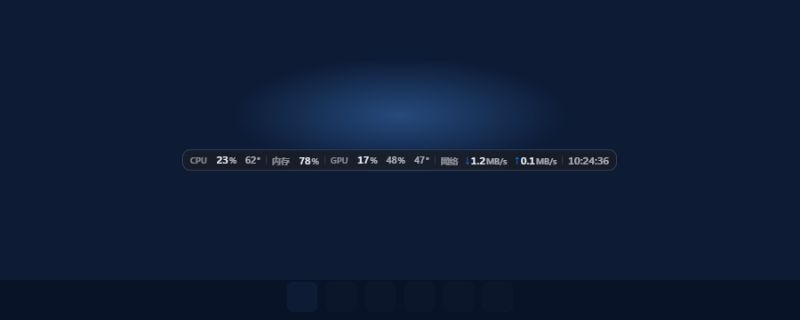

# 性能小窗 · Desktop Performance Monitor

一个常驻桌面的 Windows 11 实时性能检测小窗。把系统状态一目了然地放在屏幕角落，不用为看一眼 CPU / 内存而打开任务管理器。

透明、无边框、置顶的单行性能条，可随意拖动、贴边悬靠，位置跨重启记忆。平时通过托盘图标常驻后台。

实现只有一套，在 `electron/` 目录下：Electron + Vue 3，Node 主进程 + Vue SFC 渲染层。

## 效果预览



## 图标

应用与托盘图标均为透明背景的极简三柱图形（三根实心圆角柱，高低错落，图案约占画布 80%）：

- **应用 / 安装器图标**（`resources/icon.ico`、`resources/icon.png`）：黑色三柱
- **托盘图标**（`resources/tray-light.png`、`resources/tray-dark.png`）：随系统或设置主题联动——浅色主题用黑色、深色主题用白色，切换主题即时更新


## 功能

- **实时指标**：CPU 使用率与温度、内存占用、GPU 使用率、显存占用与温度、网络上下行速率，以及可独立开关的本地时间（`HH:mm:ss`）
- **紧凑形态**：单行横向性能条，窗口宽度随已启用指标自适应；采用近黑 / 纸白磨砂材质、发丝分隔线、主读数与温度/显存辅助读数层级，等宽数字稳定更新，网络方向以蓝色箭头轻量强调
- **自由摆放**：整窗拖动；拖到屏幕边缘 8px 内自动吸附贴边（四边均可，可同时贴两条边，如左上角），吸附后把卡片四周的透明边距推出屏幕、使**可视卡片**紧贴屏幕边；拖离即解除；位置跨重启记忆，多显示器各自记忆
- **托盘常驻**：左键单击托盘图标切换小窗显隐；右键菜单可显示 / 隐藏、打开设置、退出
- **低打扰启动**：启动只显示小窗，不弹出主界面；设置窗口按需懒创建
- **省资源**：小窗隐藏时暂停采样轮询；子进程（nvidia-smi 等）统一隐藏控制台窗口，避免黑窗闪烁
- **可配置**：设置窗口可切换各指标（含时间）开关、调整刷新频率、选择开机自启

## 系统要求

- Windows 11（x64）
- GPU 数据依赖 NVIDIA 显卡（通过 `nvidia-smi`），AMD 集显将显示 `--`
- CPU 温度走 WMI ACPI 热区，需要管理员权限；非管理员运行时 CPU 温度显示 `--`，其余指标正常

## 安装

目前为自用工具，未做分发与签名。

在 `electron/` 下执行 `npm run dev` 直接启动（不弹 UAC，CPU 温度显示 `--`）；执行 `npm run dist` 打安装包，产物在 `electron/dist/`（NSIS 安装器，安装后以管理员权限运行）。

## 开发

```bash
cd electron
npm install
npm run dev         # 开发模式（Vite 绑 127.0.0.1，原因见 AGENTS.md）
npm test            # vitest：贴边几何 / 设置策略 / 采样竞态 / FFI 边界
npm run typecheck   # tsc（主进程）+ vue-tsc（渲染层）
npm run build       # electron-vite 三段构建到 out/
npm run measure:alignment   # 文字垂直居中的真像素量具：19 组合、约 5 秒；四条判据（共线/居中/边距/裁切）+ 字体栈轴，退出码非 0 即红。共线量的是各 run 的「主体中线」
npm run dist        # 构建 + 打包 NSIS 安装器到 electron/dist/
```

## 使用

- **拖动**：按住小窗任意位置拖动，松开即落在新位置。
- **贴边**：拖到屏幕边缘附近自动吸附（可同时贴两条边，如左上角）；吸附后可视卡片紧贴屏幕边（卡片四周透明边距被推出屏幕外）；沿贴边方向拖离会被吸回，向屏幕内拖离超过 8px 阈值即解除。
- **托盘**：左键单击图标显隐小窗；右键菜单（显示 / 隐藏、设置、退出）。退出仅通过托盘菜单。
- **小窗右键**：在小窗上右键弹出与托盘相同的菜单。
- **设置**：托盘右键菜单 → 设置，可配置各指标（含时间）开关、刷新率与开机自启。
- **单实例**：重复启动会聚焦已有实例，不会出现两个小窗或两个托盘。

## 技术架构

后端独占采样，按间隔把指标快照推给小窗渲染层；渲染层只负责显示，单写入者无阻塞。设置落盘为 JSON，小窗位置由后端独占记忆。

- **栈**：Node 主进程 + Vue 3 渲染层（`<script setup>` SFC，两个独立入口）
- **刷新节奏**：CPU / 内存 / 网络 1 秒；GPU / 显存 / 温度 3 秒（设置中可调）；时间在小窗中独立每秒更新
- **数据源**：
  - CPU / 内存：`node:os` 的 CPU 时间片差分 + `totalmem`/`freemem`
  - 网络：用网卡累计收发字节差分算速率，只统计**物理网卡**、在候选集里取收发之和最大的那块、按真实差分窗口摊平（ADR-0004）——koffi 直调 `iphlpapi!GetIfTable2Ex`，不起 PowerShell
  - GPU 使用率 / 显存占用 / 温度：异步 `nvidia-smi`（仅 NVIDIA）
  - CPU 温度：WMI `MSAcpi_ThermalZoneTemperature`（ACPI 热区，需管理员）——进程内经 `koffi` 直接调用 COM/WMI，不启动常驻 PowerShell
- **窗口行为**（贴边悬靠 / 全屏自动隐藏 / 托盘常驻 / 开机自启）：`dock.ts`、`widgetWindow.ts`、`fullscreenWatcher.ts`、`tray.ts`、`autostart.ts`，并以 koffi 直调 Win32 取前台窗口与进程令牌
- **文字对齐**：两件事。① 居中与「最大字样到可视边框那格边距」（`WIDGET_EDGE_GAP`，现 6px）由盒子给——卡片内容盒裁到最大字号那批 run 的墨迹外框，卡高因此随字号呼吸（实测 20.8→26.4），没有可调数字；② 混了四档字号的各角色彼此共线才由那条定律负责（`vertical-align`，两个无量纲常数项，整条 bar 共用同一条基线），常数从合成位图的墨迹上下沿反解。改渲染层任何文字样式都要跑 `npm run measure:alignment` 复验（ADR-0006）
- **提权**：release 构建嵌入 `requireAdministrator` manifest；运行时用进程令牌 TokenElevation 检测兜底 UAC 提权重启，拒绝则降级运行；dev 模式跳过提权
- **内存**：已改为进程内直接查 WMI 与 iphlpapi，不再为 CPU 温度常驻 `powershell.exe`；安装版稳定态实测 107.2 MB 私有内存，构成与测量口径见 `electron/README.md`

## 项目结构

```
electron/
  src/main/       Node 主进程（窗口、托盘、贴边、全屏、自启、提权、指标采样、koffi FFI）
  src/preload/    contextBridge 门面：渲染层只拿得到 5 个方法
  src/renderer/   Vue 3 渲染层（widget / settings 两个入口）
  src/shared/     与主进程同源的几何常量与类型
resources/        应用与托盘图标
docs/             截图、主题预览、ADR 决策记录
scripts/gen-icon.mjs  图标生成脚本（生成 resources/ 下的 PNG/ICO）
```

## 已知限制

- 自用工具：无代码签名、无自动更新、无崩溃上报
- GPU 数据仅支持 NVIDIA；CPU 温度在部分机型 / 非管理员下不可用
- 仅支持 Windows 11（spec 明确不含 macOS / Linux）
- CPU 温度直接经 `koffi` 调用 COM/WMI 的 `MSAcpi_ThermalZoneTemperature`，不再启动常驻 PowerShell；非管理员、没有 ACPI 热区或 WMI 查询失败时显示 `--`
- 已关掉 GPU 硬件加速以省 62 MB。窗口内容已逐像素比对过与开启时一致，但**透明通道的最终合成效果尚未在真实桌面上肉眼确认**（测量手段受限，见 `electron/README.md`）；若小窗变成一块不透明底，删掉 `electron/src/main/index.ts` 里的 `app.commandLine.appendSwitch('disable-gpu')` 即可还原
- `electron/` 的打包验证到安装版运行：NSIS 安装器、koffi 的 `app.asar.unpacked` 解包、exe 内嵌的 `requireAdministrator` manifest、提权启动与 CPU 温度真值都实测过；托盘图标与开机自启在打包环境下仍未逐项实测
